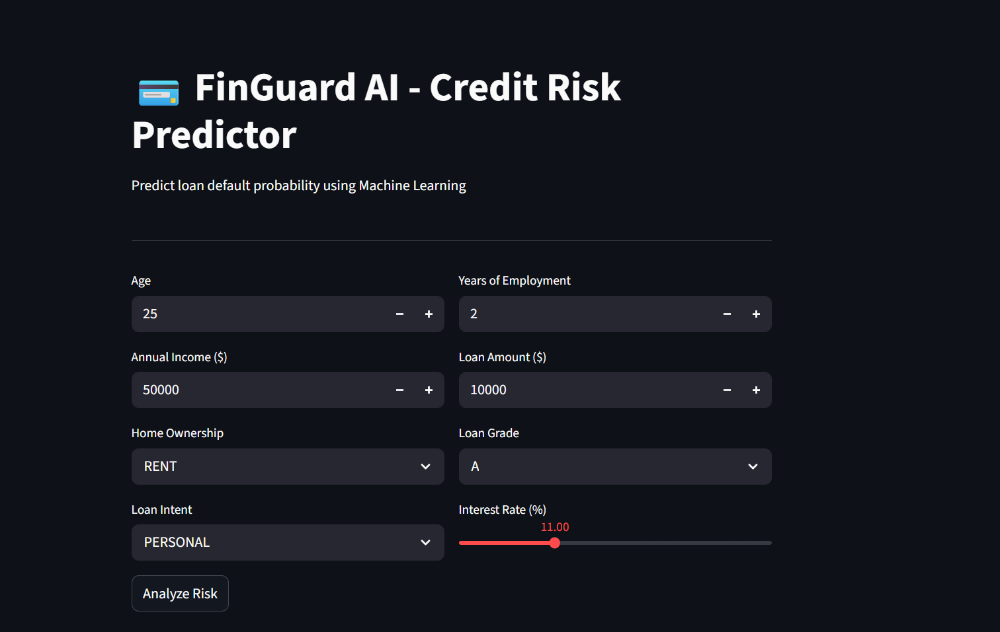
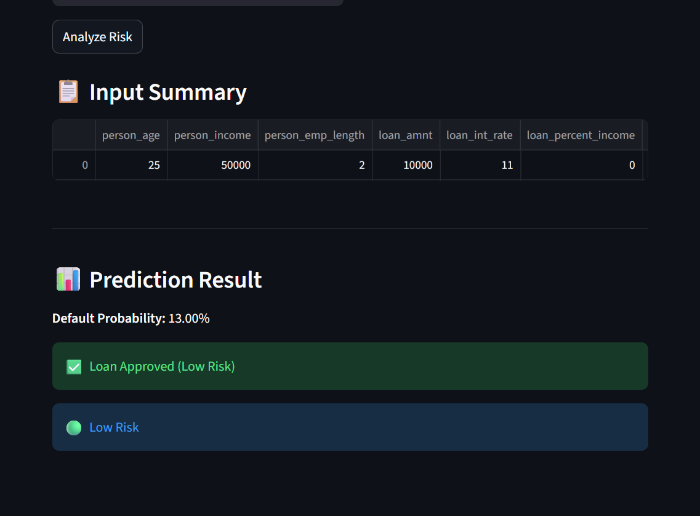

# 💳 FinGuard: AI-Powered Credit Risk Assessment

An end-to-end Machine Learning web application designed to predict the likelihood of loan default.  
This project demonstrates a complete data science pipeline—from Exploratory Data Analysis (EDA) and handling imbalanced data to deploying an interactive Streamlit application.

---

## 🚀 Live Demo
👉 [View Live App](https://credit-risk-predictor-ai-bnbqqfdhappkzx2eyseydeu.streamlit.app/)  <!-- Replace with your Streamlit link -->

---

## 📊 Project Overview

Credit risk assessment is a critical problem for financial institutions.  
This project uses Machine Learning models to predict whether a loan applicant is likely to default based on financial and demographic features such as income, age, employment length, and loan details.

---

## 🧠 Machine Learning Approach

### Models Used:
- Logistic Regression (Baseline)
- Random Forest Classifier (Final Model)

### Why Random Forest?
Random Forest outperformed Logistic Regression due to its ability to capture **non-linear relationships** and interactions between features.

---

## 📈 Model Performance

| Model                  | ROC-AUC |
|-----------------------|--------|
| Logistic Regression   | 0.81   |
| Random Forest         | 0.92   |

---

## ⚙️ Techniques Used

- **SMOTE (Synthetic Minority Oversampling Technique)**  
  → Handled class imbalance effectively  

- **Threshold Tuning (0.3)**  
  → Improved recall for detecting defaulters  

- **SHAP (Explainable AI)**  
  → Interpreted model predictions and feature importance  

- **Model Comparison**  
  → Evaluated multiple models using ROC-AUC  

---

## 📊 Key Insights

- 💰 **Income** is the most influential feature affecting loan default  
- 👤 **Age** has a moderate impact  
- 🎯 Model optimized for **high recall** to reduce false negatives (missing risky applicants)  
- ⚖️ Trade-off between precision and recall handled using threshold tuning  

---

## 🖥️ Streamlit App Features

- User-friendly interface for inputting applicant details  
- Displays:
  - Default probability  
  - Loan approval/rejection decision  
  - Risk category (Low / Medium / High)  
- Real-time predictions  

---

## 🧪 Sample Output

### 📌 Input Form


### 📌 Prediction Result


- 📌 Input form  
- 📌 Prediction result  
- 📌 Risk classification  

---

## 🛠️ Tech Stack

- **Programming Language:** Python  
- **Libraries:**  
  - Scikit-learn  
  - Pandas, NumPy  
  - Matplotlib, Seaborn  
  - Imbalanced-learn (SMOTE)  
  - SHAP  
- **Frontend:** Streamlit  

---

## 📁 Repository Structure

```text
├── app.py                   # Streamlit web application
├── credit_risk_model.pkl    # Pre-trained Random Forest model
├── model_columns.pkl        # List of features for data alignment
├── requirements.txt         # Project dependencies
└── README.md                # Project documentation
